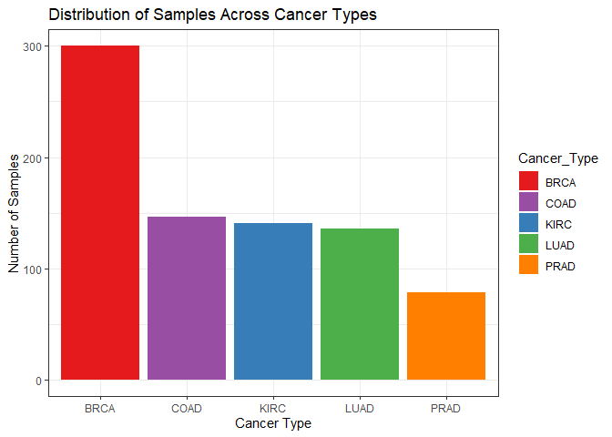
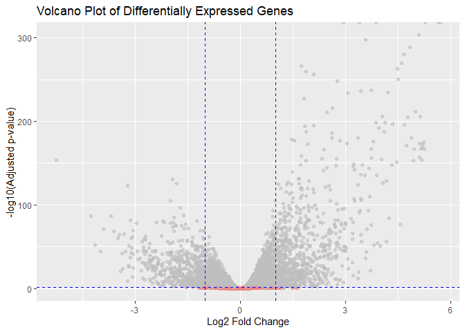
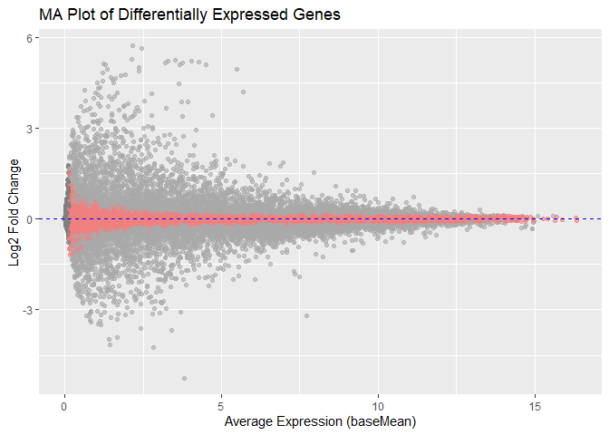
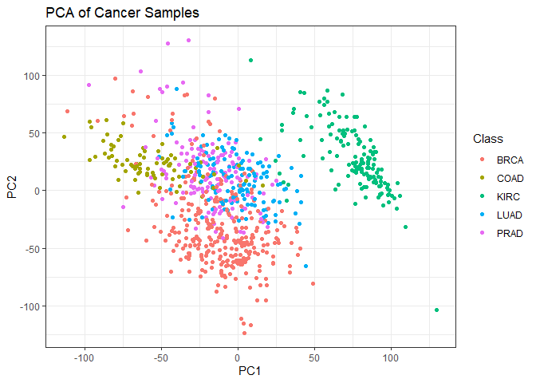
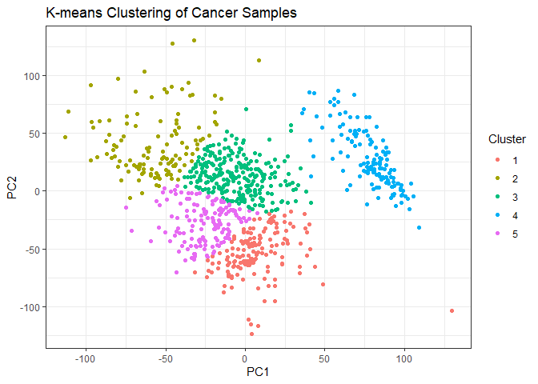
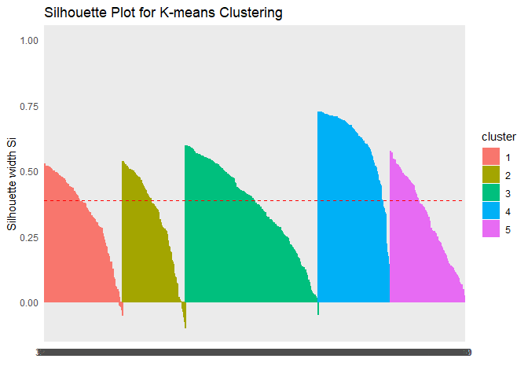

## 🔬 Project Overview

This project explores gene expression variation across five cancer types (BRCA, KIRC, LUAD, COAD, PRAD) using RNA-Seq count data. Differential expression was assessed using DESeq2, followed by PCA, clustering, and visualization to identify cancer-specific gene signatures.


### STEP - 1: Loading Libraries


``` r
library(tidyverse)
library(tidyr)
library(DESeq2)
library(ggplot2)
library(VennDiagram)
library(UpSetR)
library(RColorBrewer)
library(pheatmap)
library(reshape2)
library(pROC)
library(caret)
library(parallel)
library(mltools)
library(MASS)
library(ggfortify)
library(stats)
library(data.table)
```

### STEP - 2: Loading Data + Normalization:

``` r
# Set the paths for data and labels
data_path <- "data/data.csv"
labels_path <- "data/labels.csv"

data <- read.csv(data_path, header = TRUE)
labels <- read.csv(labels_path, header = TRUE)

merged_data <- merge(data, labels, by = "X", all.x = TRUE)
merged_data <- na.omit(merged_data)
merged_data$Class <- as.factor(merged_data$Class)
gc()
```

```
             used  (Mb) gc trigger  (Mb) max used  (Mb)
  Ncells  6916730 369.4   12753420 681.2 12143498 648.6
  Vcells 46009725 351.1   75790008 578.3 75789976 578.3
```

### STEP -3: Data division visualisation:

``` r
# Count samples for each cancer type
class_data <- as.data.frame(table(merged_data$Class))
colnames(class_data) <- c("Cancer_Type", "Count")
class_data$Count <- sort(class_data$Count, decreasing = TRUE)
cancer_colors <- c(
  BRCA = "#E41A1C",
  KIRC = "#377EB8",
  LUAD = "#4DAF4A",
  COAD = "#984EA3",
  PRAD = "#FF7F00"
)
# Create bar plot
data_division <- ggplot(class_data, aes(x = Cancer_Type, y = Count, fill = Cancer_Type)) +
  geom_bar(stat = "identity") +
  theme_gray() +
  labs(title = "Distribution of Samples Across Cancer Types",
       x = "Cancer Type",
       y = "Number of Samples")+
  scale_fill_manual(values = cancer_colors) +
  theme_bw()
print(data_division)
```



``` r
ggsave("plots/sample_distribution.png", plot = data_division, width = 8, height = 5)
gc()
```

```
             used  (Mb) gc trigger  (Mb) max used  (Mb)
  Ncells  7092322 378.8   12753420 681.2 12143498 648.6
  Vcells 46352561 353.7   75790008 578.3 75789976 578.3
```
### STEP - 4: DESeq2 Analysis

``` r
# 1. Prepare data
# This intermediate variable holds the numeric data with samples as rows
gene_data <- merged_data[, !names(merged_data) %in% c("X", "Class")]
rownames(gene_data) <- merged_data$X

# Transpose to get the final matrix: genes as rows, samples as columns
gene_expr_matrix <- t(gene_data)
gene_expr_matrix <- round(gene_expr_matrix) # Ensure integer counts

# Prepare sample information
sample_info <- data.frame(Class = merged_data$Class)
rownames(sample_info) <- merged_data$X

# 2. Create DESeq2 object
# Check for matching sample names
stopifnot(all(colnames(gene_expr_matrix) == rownames(sample_info)))
dds <- DESeqDataSetFromMatrix(countData = gene_expr_matrix,
                              colData = sample_info,
                              design = ~ Class)
```

```
  converting counts to integer mode
```

``` r
# 3. Run analysis
dds <- DESeq(dds)
```

```
  estimating size factors
```

```
  estimating dispersions
```

```
  gene-wise dispersion estimates
```

```
  mean-dispersion relationship
```

```
  -- note: fitType='parametric', but the dispersion trend was not well captured by the
     function: y = a/x + b, and a local regression fit was automatically substituted.
     specify fitType='local' or 'mean' to avoid this message next time.
```

```
  final dispersion estimates
```

```
  fitting model and testing
```

``` r
res <- results(dds) # Get full results for plotting

# 4. Get significant genes
res_sig <- subset(res, padj < 0.05 & !is.na(padj)) # Filter for significance
print(summary(res_sig))
```

```
  
  out of 7639 with nonzero total read count
  adjusted p-value < 0.1
  LFC > 0 (up)       : 3920, 51%
  LFC < 0 (down)     : 3719, 49%
  outliers [1]       : 0, 0%
  low counts [2]     : 0, 0%
  (mean count < 0)
  [1] see 'cooksCutoff' argument of ?results
  [2] see 'independentFiltering' argument of ?results
  
  NULL
```

``` r
sig_gene_names <- rownames(res_sig)

# Extract normalized counts for visualization
sig_genes_data <- as.data.frame(counts(dds, normalized = TRUE)[sig_gene_names, ])
sig_genes_data$Gene <- rownames(sig_genes_data)
```


``` r
# --- MORE ROBUST Cleaning, Clustering, and Reshaping ---

# 1. Create a clean numeric matrix from sig_genes_data
gene_names <- sig_genes_data$Gene
numeric_data <- sig_genes_data[, -which(names(sig_genes_data) == "Gene")]
rownames(numeric_data) <- gene_names

# 2. Find which genes (rows) are valid for analysis
is_row_valid <- apply(numeric_data, 1, function(row) {
  all(is.finite(row)) && var(row, na.rm = TRUE) > 0
})

# 3. Create the final, clean data matrix
gene_matrix_for_clustering <- numeric_data[is_row_valid, , drop = FALSE] # drop=FALSE is safer

# 4. === ADDED SAFETY CHECK ===
# Check if we have enough genes to perform clustering
if (nrow(gene_matrix_for_clustering) >= 2) {

  # Perform clustering on the GENES
  gene_hclust <- hclust(dist(gene_matrix_for_clustering))
  ordered_gene_names <- rownames(gene_matrix_for_clustering)[gene_hclust$order]

  # Filter the original data frame to keep only the clean genes
  sig_genes_data_clean <- sig_genes_data[is_row_valid, ]

  # Reshape the CLEAN data into a long format for plotting
  sig_genes_data_long <- pivot_longer(
    sig_genes_data_clean,
    cols = -Gene,
    names_to = "Sample",
    values_to = "Expression"
  )

  # Set the Gene factor levels based on the clustering order
  sig_genes_data_long$Gene <- factor(sig_genes_data_long$Gene,
                                     levels = ordered_gene_names)
  
  print(paste("Successfully clustered", length(ordered_gene_names), "genes."))

} else {
  
  print("Skipping clustering: Fewer than 2 genes remained after filtering.")
  # Create an empty data frame so the script doesn't fail later
  sig_genes_data_long <- data.frame() 
  
}
```

```
## [1] "Successfully clustered 7639 genes."
```

``` r
gc()
```

```
##             used   (Mb) gc trigger   (Mb)  max used   (Mb)
## Ncells   7194010  384.3   12753420  681.2  12753420  681.2
## Vcells 163431885 1246.9  389638986 2972.8 389638795 2972.8
```
### STEP - 5: DDSEQ2 - Visualisation:

``` r
# Create a volcano plot
volcano_plot <- ggplot(res, aes(x = log2FoldChange, y = -log10(padj))) +
  geom_point(aes(color = ifelse(padj < 0.05, "Significant", "Not Significant")), alpha = 0.6) +
  scale_color_manual(values = c("lightcoral", "gray"), guide = FALSE) +  # Remove color legend
  geom_vline(xintercept = c(-1, 1), linetype = "dashed", color = "blue") +
  geom_hline(yintercept = -log10(0.05), linetype = "dashed", color = "blue") +  # Added significance line
  labs(title = "Volcano Plot of Differentially Expressed Genes",
       x = "Log2 Fold Change",
       y = "-log10(Adjusted p-value)") +
  theme_gray()

print(volcano_plot)
```

```
  Warning: The `guide` argument in `scale_*()` cannot be `FALSE`. This was deprecated in
  ggplot2 3.3.4.
  ℹ Please use "none" instead.
  This warning is displayed once every 8 hours.
  Call `lifecycle::last_lifecycle_warnings()` to see where this warning was
  generated.
```

```
  Warning: Removed 1461 rows containing missing values or values outside the scale range
  (`geom_point()`).
```



``` r
ggsave("plots/volcano_plot.png", plot = volcano_plot, width = 8, height = 6)
```

```
  Warning: Removed 1461 rows containing missing values or values outside the scale range
  (`geom_point()`).
```

``` r
# Create an MA plot
ma_plot <- ggplot(res, aes(x = baseMean, y = log2FoldChange)) +
  geom_point(aes(color = ifelse(padj < 0.05, "Significant", "Not Significant")), alpha = 0.6) +
  scale_color_manual(values = c("lightcoral", "darkgray"), guide = FALSE) +  # Remove color legend
  geom_hline(yintercept = 0, linetype = "dashed", color = "blue") +
  labs(title = "MA Plot of Differentially Expressed Genes",
       x = "Average Expression (baseMean)",
       y = "Log2 Fold Change") +
  theme_gray()

print(ma_plot)
```

```
  Warning: Removed 284 rows containing missing values or values outside the scale range
  (`geom_point()`).
```



``` r
ggsave("plots/ma_plot.png", plot = ma_plot, width = 8, height = 6)
```

```
  Warning: Removed 284 rows containing missing values or values outside the scale range
  (`geom_point()`).
```
### STEP - 6: PCA

``` r
# Load libraries if they aren't already
library(matrixStats)
library(cluster)
```

```
  Warning: package 'cluster' was built under R version 4.3.3
```

``` r
library(factoextra)
```

```
  Warning: package 'factoextra' was built under R version 4.3.3
```

```
  Welcome! Want to learn more? See two factoextra-related books at https://goo.gl/ve3WBa
```

``` r
# --- PCA Step ---
# Use variance-stabilized data for best results
vst_data <- varianceStabilizingTransformation(dds, blind = FALSE)
vst_assay <- assay(vst_data)

# Filter out genes with zero variance to prevent errors
vst_assay_filtered <- vst_assay[rowVars(vst_assay) > 0, ]

# Run PCA on the samples
pca_results <- prcomp(t(vst_assay_filtered), center = TRUE, scale. = TRUE)

# Extract the PC scores for plotting
pca_scores <- as.data.frame(pca_results$x)
pca_scores$Class <- colData(dds)$Class

# Print PCA plot (colored by true cancer type)
pca_plot <- ggplot(pca_scores, aes(x = PC1, y = PC2, color = Class)) +
  geom_point(size = 1.5) +
  labs(title = "PCA of Cancer Samples", x = "PC1", y = "PC2") +
  scale_fill_manual(values = cancer_colors) +
  theme_bw()
print(pca_plot)
```

```
  Warning: No shared levels found between `names(values)` of the manual scale and the
  data's fill values.
```


### Step - 7: K- clustering

``` r
# --- K-means Clustering Step ---
# Perform K-means on the correct PCA scores
kmeans_result <- kmeans(pca_scores[, c("PC1", "PC2")], centers = 5, nstart = 25)
pca_scores$K_Cluster <- factor(kmeans_result$cluster)

# Print K-means plot (colored by algorithm-found clusters)
cluster_plot <- ggplot(pca_scores, aes(x = PC1, y = PC2, color = K_Cluster)) +
  geom_point(size = 1.5) +
  labs(title = "K-means Clustering of Cancer Samples", x = "PC1", y = "PC2", color = "Cluster") +
  theme_bw()
print(cluster_plot)
```




``` r
# Assess cluster validity
silhouette_analysis <- silhouette(kmeans_result$cluster, dist(pca_scores[, c("PC1", "PC2")]))
print(summary(silhouette_analysis))
```

```
## Silhouette of 801 units in 5 clusters from silhouette.default(x = kmeans_result$cluster, dist = dist(pca_scores[, c("PC1", "PC2")])) :
##  Cluster sizes and average silhouette widths:
##       149       120       253       137       142 
## 0.3396739 0.3221859 0.3692233 0.6006290 0.3192533 
## Individual silhouette widths:
##     Min.  1st Qu.   Median     Mean  3rd Qu.     Max. 
## -0.09723  0.25979  0.40966  0.38740  0.51866  0.72605
```

``` r
# Check the new cluster centroids
print(kmeans_result$centers)
```

```
##          PC1       PC2
## 1   7.334241 -54.63707
## 2 -56.601718  41.47128
## 3  -5.426191  13.29876
## 4  78.170256  27.19454
## 5 -25.613343 -27.64696
```

``` r
# Create and plot the silhouette using factoextra
library(factoextra)
sil_plot <- fviz_silhouette(silhouette_analysis) +
  theme_minimal() +
  labs(title = "Silhouette Plot for K-means Clustering")
```

```
##   cluster size ave.sil.width
## 1       1  149          0.34
## 2       2  120          0.32
## 3       3  253          0.37
## 4       4  137          0.60
## 5       5  142          0.32
```

``` r
print(sil_plot)
```

<!-- -->

``` r
ggsave("plots/silhouette_plot.png", plot = sil_plot, width = 8, height = 6)
```


``` r
### Corrected Gene Expression Heatmap ###

# Ensure these libraries are loaded
library(pheatmap)
library(matrixStats)

# 1. Use variance-stabilized data from the previous steps
vst_data <- varianceStabilizingTransformation(dds, blind = FALSE)

# 2. Find the top 50 most variable genes to visualize
top_var_genes <- head(order(rowVars(assay(vst_data)), decreasing = TRUE), 50)
heatmap_matrix <- assay(vst_data)[top_var_genes, ]

# 3. Create an annotation bar for the sample cancer types
annotation_col <- data.frame(
  CancerType = colData(dds)$Class
)
rownames(annotation_col) <- colnames(heatmap_matrix)
ann_colors <- list(CancerType = cancer_colors)

# 4. Generate the heatmap and save it to a file
# 'scale = "row"' is crucial for visualizing relative gene expression
pheatmap(heatmap_matrix,
         scale = "row",
         annotation_col = annotation_col,
         annotation_colors = ann_colors,
         show_rownames = FALSE,
         show_colnames = FALSE,
         main = "Heatmap of Top 50 Variable Genes",
         filename = "plots/heatmap_expression.png",
         width = 8,
         height = 6)
```
## ✅ Conclusion

This project demonstrates the ability of RNA-Seq analysis to uncover meaningful differences in gene expression across multiple cancer types. Techniques like DESeq2, PCA, and unsupervised clustering provided statistically and biologically relevant insights into transcriptomic profiles.

## 🔁 Session Info


``` r
sessionInfo()
```

```
## R version 4.3.2 (2023-10-31 ucrt)
## Platform: x86_64-w64-mingw32/x64 (64-bit)
## Running under: Windows 11 x64 (build 22631)
## 
## Matrix products: default
## 
## 
## locale:
## [1] LC_COLLATE=English_India.utf8  LC_CTYPE=English_India.utf8   
## [3] LC_MONETARY=English_India.utf8 LC_NUMERIC=C                  
## [5] LC_TIME=English_India.utf8    
## 
## time zone: America/Chicago
## tzcode source: internal
## 
## attached base packages:
##  [1] parallel  grid      stats4    stats     graphics  grDevices utils    
##  [8] datasets  methods   base     
## 
## other attached packages:
##  [1] factoextra_1.0.7            cluster_2.1.8              
##  [3] data.table_1.16.4           ggfortify_0.4.17           
##  [5] MASS_7.3-60.0.1             mltools_0.3.5              
##  [7] caret_7.0-1                 lattice_0.22-6             
##  [9] pROC_1.18.5                 reshape2_1.4.4             
## [11] pheatmap_1.0.12             RColorBrewer_1.1-3         
## [13] UpSetR_1.4.0                VennDiagram_1.7.3          
## [15] futile.logger_1.4.3         DESeq2_1.42.1              
## [17] SummarizedExperiment_1.32.0 Biobase_2.62.0             
## [19] MatrixGenerics_1.14.0       matrixStats_1.4.1          
## [21] GenomicRanges_1.54.1        GenomeInfoDb_1.38.8        
## [23] IRanges_2.36.0              S4Vectors_0.40.2           
## [25] BiocGenerics_0.48.1         lubridate_1.9.4            
## [27] forcats_1.0.0               stringr_1.5.1              
## [29] dplyr_1.1.4                 purrr_1.0.2                
## [31] readr_2.1.5                 tidyr_1.3.1                
## [33] tibble_3.2.1                ggplot2_3.5.1              
## [35] tidyverse_2.0.0            
## 
## loaded via a namespace (and not attached):
##  [1] rstudioapi_0.17.1       jsonlite_1.8.9          magrittr_2.0.3         
##  [4] farver_2.1.2            rmarkdown_2.29          zlibbioc_1.48.2        
##  [7] ragg_1.3.3              vctrs_0.6.5             RCurl_1.98-1.16        
## [10] rstatix_0.7.2           htmltools_0.5.8.1       S4Arrays_1.2.1         
## [13] lambda.r_1.2.4          broom_1.0.7             Formula_1.2-5          
## [16] SparseArray_1.2.4       sass_0.4.9              parallelly_1.40.1      
## [19] bslib_0.8.0             plyr_1.8.9              futile.options_1.0.1   
## [22] cachem_1.1.0            lifecycle_1.0.4         iterators_1.0.14       
## [25] pkgconfig_2.0.3         Matrix_1.6-5            R6_2.5.1               
## [28] fastmap_1.2.0           GenomeInfoDbData_1.2.11 future_1.34.0          
## [31] digest_0.6.37           colorspace_2.1-1        textshaping_0.4.1      
## [34] ggpubr_0.6.0            labeling_0.4.3          fansi_1.0.6            
## [37] timechange_0.3.0        abind_1.4-8             compiler_4.3.2         
## [40] withr_3.0.2             backports_1.5.0         BiocParallel_1.36.0    
## [43] carData_3.0-5           ggsignif_0.6.4          lava_1.8.0             
## [46] DelayedArray_0.28.0     ModelMetrics_1.2.2.2    tools_4.3.2            
## [49] future.apply_1.11.3     nnet_7.3-19             glue_1.8.0             
## [52] nlme_3.1-166            generics_0.1.3          recipes_1.1.0          
## [55] gtable_0.3.6            tzdb_0.4.0              class_7.3-22           
## [58] hms_1.1.3               car_3.1-3               utf8_1.2.4             
## [61] XVector_0.42.0          ggrepel_0.9.6           foreach_1.5.2          
## [64] pillar_1.9.0            splines_4.3.2           survival_3.7-0         
## [67] tidyselect_1.2.1        locfit_1.5-9.10         knitr_1.49             
## [70] gridExtra_2.3           xfun_0.49               hardhat_1.4.0          
## [73] timeDate_4041.110       stringi_1.8.4           yaml_2.3.10            
## [76] evaluate_1.0.1          codetools_0.2-19        cli_3.6.3              
## [79] rpart_4.1.23            systemfonts_1.1.0       munsell_0.5.1          
## [82] jquerylib_0.1.4         Rcpp_1.0.13-1           globals_0.16.3         
## [85] gower_1.0.1             bitops_1.0-9            listenv_0.9.1          
## [88] ipred_0.9-15            scales_1.3.0            prodlim_2024.06.25     
## [91] crayon_1.5.3            rlang_1.1.4             formatR_1.14
```
