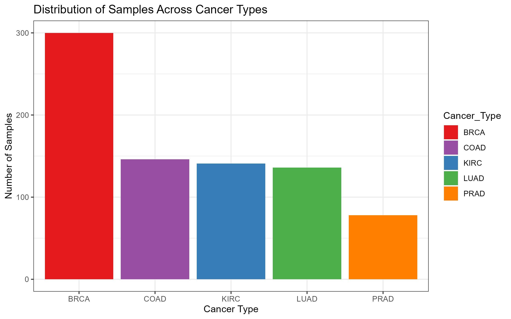
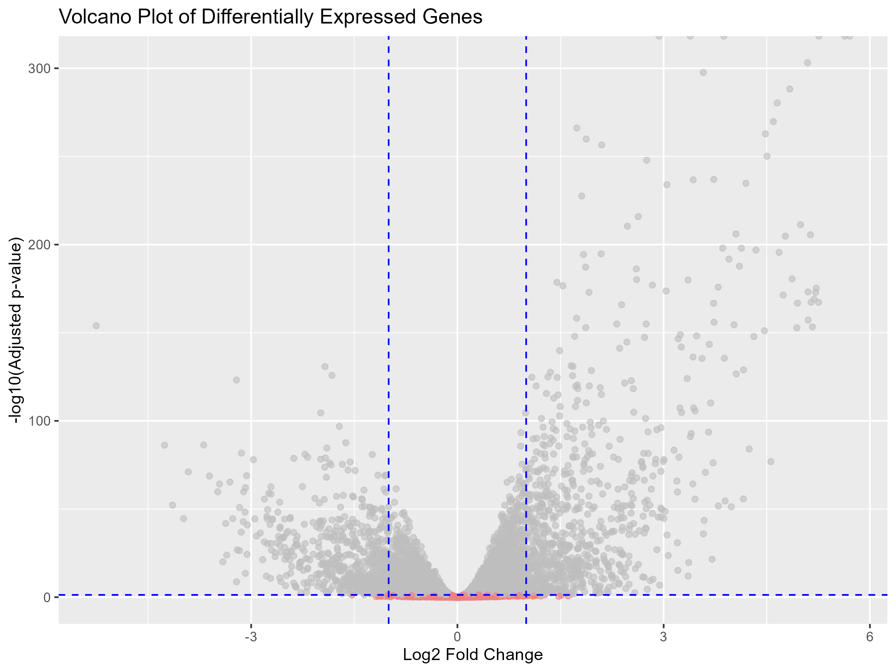
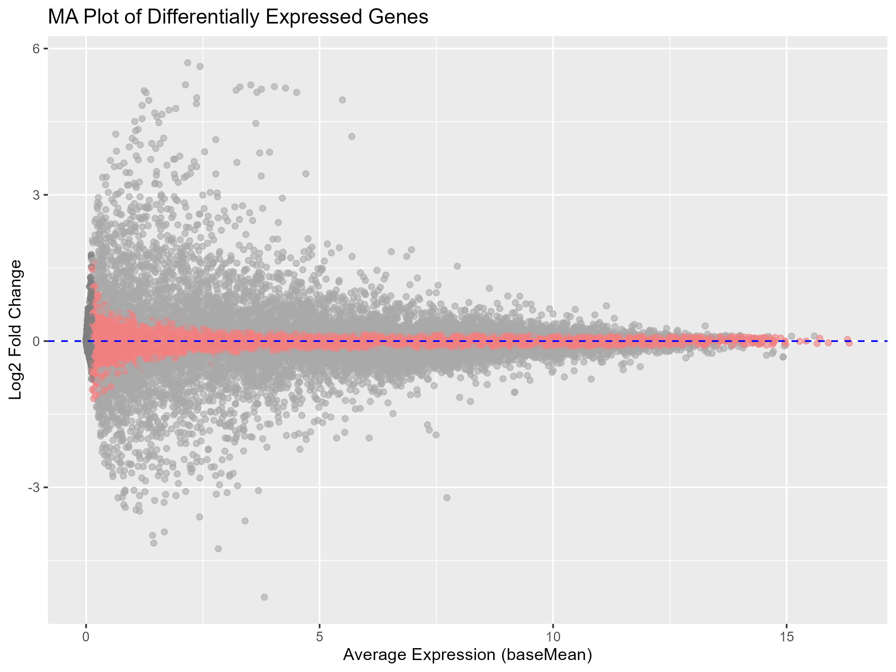
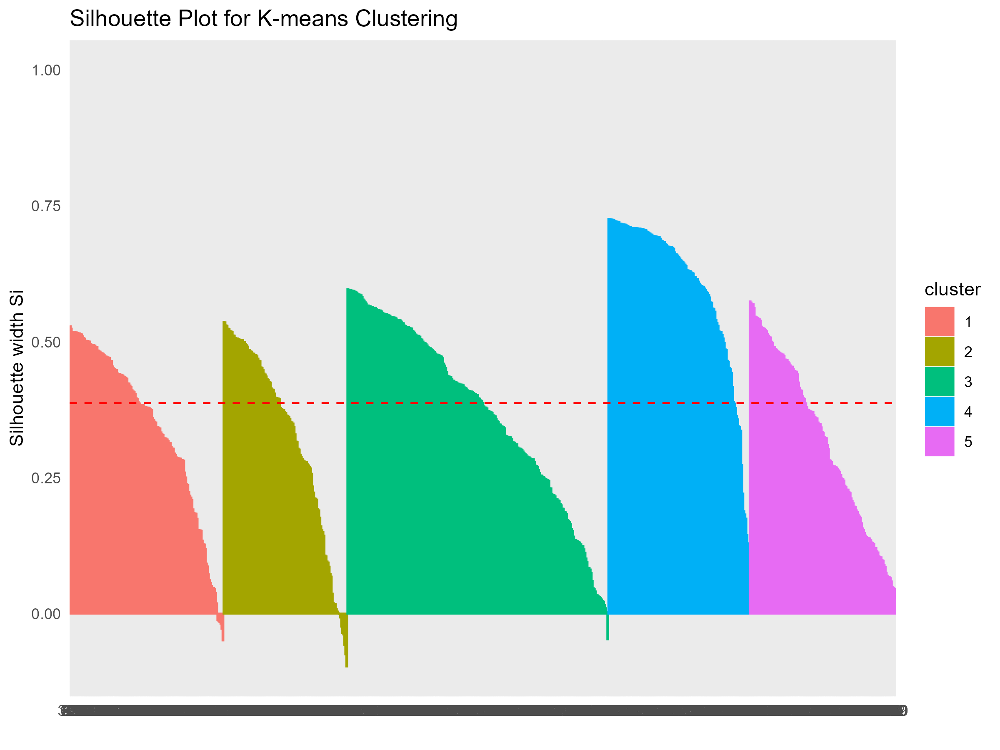
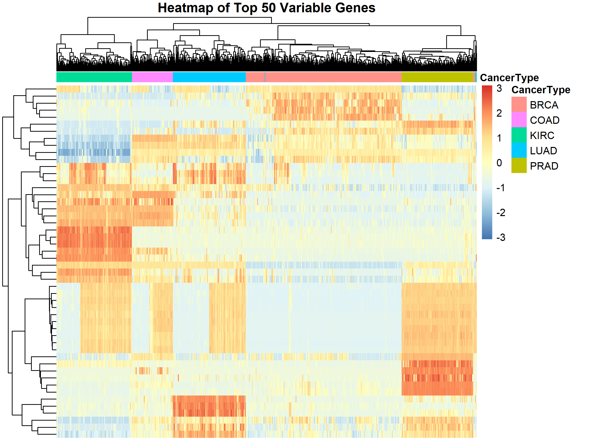

# 🧬 Gene Expression Analysis in Cancer using RNA-Seq

> **Author:** Pranava Upparlapalli  
> **Date:** June 2025

---

## 📘 Project Summary

This project analyzes RNA-Seq gene expression data across five major cancer types:

- **BRCA** – Breast invasive carcinoma  
- **KIRC** – Kidney renal clear cell carcinoma  
- **LUAD** – Lung adenocarcinoma  
- **COAD** – Colon adenocarcinoma  
- **PRAD** – Prostate adenocarcinoma  

Using the **DESeq2** pipeline in R, we performed differential expression analysis, PCA, clustering, and visualized key patterns to identify cancer-specific gene signatures.

---

## 📁 Project Structure

```bash
CANCER-RNA-SEQ-ANALYSIS/
│
├── src.R # Main code
├── plots/                     # All generated plots
│   ├── heatmap_expression.png
│   ├── ma_plot.png
│   ├── sample_distribution.png
│   ├── silhouette_plot.png
│   └── volcano_plot.png
│
├── Notebook/                  # RMarkdown and Word version of the analysis
│   ├── Project V2.Rmd
|
├── index.html                 # HTML output of the analysis
├── README.md                  # This file
└── LICENSE                    # License file
```

---

## 📦 Data Availability

The RNA-Seq count data used in this project was sourced from **Kaggle**. Due to its large size, the data files (`data.csv` and `labels.csv`) are **not included in this GitHub repository**.

You can download the dataset from Kaggle at:

🔗 [Kaggle Dataset – RNA-Seq Expression Data for Cancer Types](https://www.kaggle.com/)

After downloading, place the files inside the `data/` directory as follows:

```bash
CANCER-RNA-SEQ-ANALYSIS/
└── data/
    ├── data.csv
    └── labels.csv
```

---

## 🧪 Methods Overview

1. **Data Preprocessing**
   - Merged `data.csv` and `labels.csv`.
   - Removed missing values and ensured valid class labels.

2. **Differential Expression (DESeq2)**
   - Used DESeq2 to normalize, model, and identify significantly differentially expressed genes (padj < 0.05).

3. **Visualization**
   - Volcano plot and MA plot to show fold-change vs significance.
   - PCA to visualize clustering of samples.
   - Heatmap of top 50 most variable genes.
   - K-means clustering and silhouette plot for unsupervised pattern discovery.

---

## 📊 Visualizations

### 🔍 Sample Distribution

Shows the distribution of samples across cancer types.



---

### 🌋 Volcano Plot

Highlights significantly up/down-regulated genes.



---

### 🧮 MA Plot

Visualizes mean expression vs. fold change.



---

### 🔬 Silhouette Plot

Assesses clustering performance using PCA + K-means.



---

### 🔥 Heatmap of Top 50 Variable Genes

Displays patterns of gene expression across cancer types.



---

## 🧠 Key Findings

- Thousands of genes are differentially expressed between cancers.
- PCA showed distinct clustering of cancer types.
- K-means clustering aligned well with known classes.
- Some cancer types share expression signatures, indicating potential shared biology.

---

## ⚙️ Technologies Used

- R (v4.3.2)
- DESeq2
- ggplot2
- pheatmap
- factoextra
- tidyverse

---

## 📝 How to Run

1. Clone the repository:
   ```bash
   git clone https://github.com/yourusername/CANCER-RNA-SEQ-ANALYSIS.git
   cd CANCER-RNA-SEQ-ANALYSIS
   ```

2. Download the data from Kaggle and place it under `data/`.

3. Open `Project V2.Rmd` in RStudio.

4. Knit to HTML to generate `index.html`.

---

## 📃 License

This project is licensed under the MIT License.  
See [`LICENSE`](LICENSE) for details.

---

## 🙋‍♂️ Contact

For questions, feedback, or collaborations:  
**📧 pxu.bioinfo@gmail.com**  
**🔗 [LinkedIn](https://www.linkedin.com/in/pranava-u)**  
**🌐 [Portfolio](https://bit-2310.github.io/portfolio/)**

---
